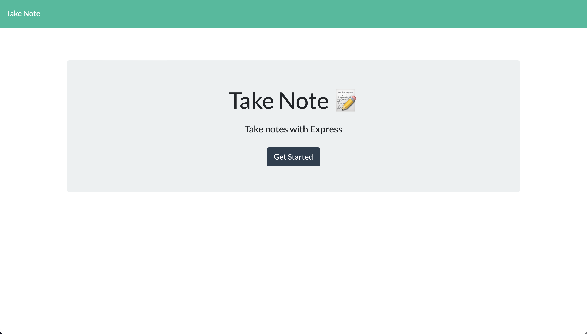
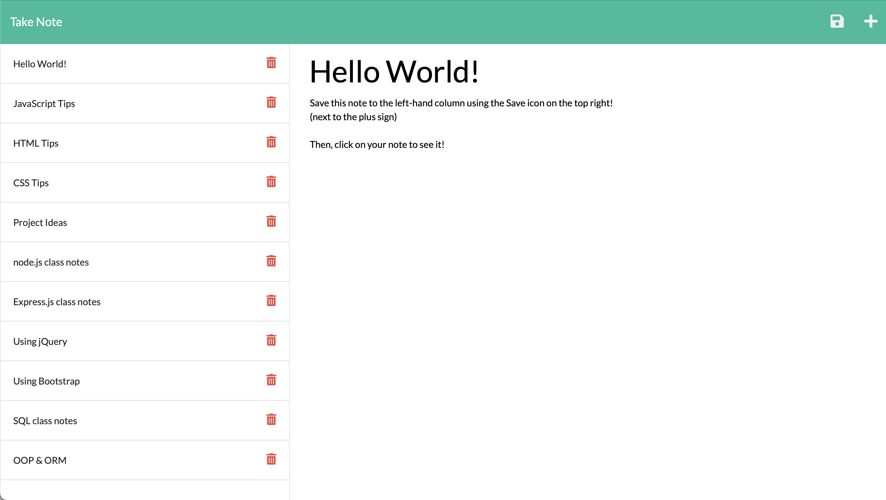

# take-note
A note taker app powered by Express.js and deployed using Heroku

## 💡 Table of Contents

- [Description](#description-id)
- [Installation](#installation-id)
- [Usage](#usage-id)
- [Screenshots](#screenshots-id)
- [Tests](#tests-id)
- [Questions](#questions-id)

## Description
This project is a note taking app called "Take Note", which utilizes *Express.js* for its back-end functioning, HTML and CSS for the front-end, and Heroku for deployment. Heroku is a Platform as a Service that supports node.js and allows you to build, run, operate, and deploy apps straight from the cloud. Express.js is a lightweight framework for node.js that lets you make API calls and HTTPS requests as well as create routes. *Routes* refer to the pathways data is sent between computers. With this app, we've set up a server in a server.js file and two routing files that connect the front-end of this app with the back-end. Using the get(), post(), and delete() Express methods (methods are ways of communicating with another computer), we are able to request JSON data from a database containing the users saved notes. Whenever the user returns to the page, their notes will be posted from their previous visit.
   
## Installation
There is no installation requirement for this application. Just click the link here: https://take-note-sg.herokuapp.com/ and follow the steps in the "Usage" section below!
    
## Usage
To use this app, click the link in the above "Installation" section. You will be directed to a homepage with a button that says "Get Started". This will redirect you to the application. Click the "Note Title" or "note text" placeholders to fill in your note. Then, hit the save icon at the top right-hand corner of the page. This will save your note to a list on the left-hand side of the page and will stay there until you click the trash can icon next to the note to delete it.

## Screenshots

    
## Tests
This application was tested using Insomnia, a client that allows you to make get(), post(), and delete() requests to ensure functionality. You can download Insomnia and give it a try here: https://insomnia.rest 

## Questions
You can check out my repositories here on my GitHub account: 
<a href="https://github.com/scottsc0de">scottsc0de</a>

AND

You can send an email to **Scott5902@gmail.com** with any questions!